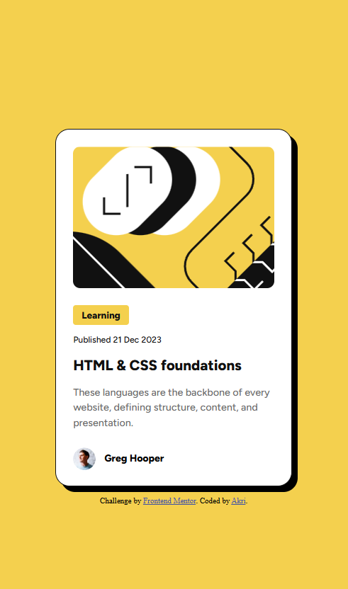

# Frontend Mentor - Blog preview card solution

This is a solution to the [Blog preview card challenge on Frontend Mentor](https://www.frontendmentor.io/challenges/blog-preview-card-ckPaj01IcS). Frontend Mentor challenges help you improve your coding skills by building realistic projects. 

## Table of contents

- [Overview](#overview)
  - [The challenge](#the-challenge)
  - [Screenshot](#screenshot)
  - [Links](#links)
- [My process](#my-process)
  - [Built with](#built-with)
  - [What I learned](#what-i-learned)
  - [Continued development](#continued-development)
  - [Useful resources](#useful-resources)
- [Author](#author)

## Overview

### The challenge

Users should be able to:

- See hover and focus states for all interactive elements on the page

### Screenshot




### Links

- [Solution URL](https://www.frontendmentor.io/solutions/blog-preview-card-resizing-fonts-without-using-media-queries-x-G51EJNqL)
- [Live Site URL](https://akri-dev.github.io/frontend-mentor_blog-preview-card/)

## My process

### Built with

- Semantic HTML5 markup
- CSS custom properties
- Flexbox
- Mobile-first workflow
- `calc()` function
- Viewport Lessons

### What I learned

Figured out how to scale a font based on viewport size

Example:

minimum viewport size = 375px = font-size = 12px

maximum viewport size = 1440px = font-size = 14px

```css
font-size: calc(12px + (12 * ((100vw - 375px) / (1440 - 375))));
```

### Continued development

Use the `calc()` function if the site is not that complicated instead of using media queries

### Useful resources

- [Bigger fonts on smaller screens without @media queries or javascript?](https://stackoverflow.com/questions/35978790/bigger-fonts-on-smaller-screens-without-media-queries-or-javascript) - This helped me understand viewport units.
## Author

- Website - [Personal Portfolio](https://akri-dev.github.io/av-portfolio/)
- Frontend Mentor - [@akri-dev](https://www.frontendmentor.io/profile/akri-dev)
